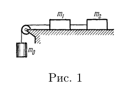

# Проект по теме механика

## Команда НЕЙРОТЕХ

### Условие задачи
На рисунке приведена схема установки. Нить и блок невесомы, а нить еще и нерастяжима. Грузы скользят по поверхности с коэффициентом трения $k$. Пользователю предлагается привести установку в движение и по известным массам грузов найти $k$ и силу натяжения нити между $m_1$ и $m_2$.

### Формулы
Конечные формулы для решения задач пользователем:
$k=\frac{m_0}{m_1+m_0} - \frac{2h (m_0 + m_1 + m_2)}{g t^2(m_1+m_2)}$

$T_{12}=\frac{m_2 m_0 g (1 + k)}{m_0 + m_1 + m_2}$

Формулы, используемые в программе:

$v = \frac{(m_0-(m_1 + m_2)k)gt}{m_0 + m_1 + m_2}$

$T_{12}=\frac{m_2 m_0 g (1 + k)}{m_0 + m_1 + m_2}$

### Стек технологий
- HTML
- CSS
- React.js
- Matter.js

### Это мы

[даня чими](https://github.com/deadxraver)

[геруня солнышко](https://github.com/GeruniaSun)

[алена динах](https://github.com/dllnnx)

[катяпим](https://github.com/p11menova)
